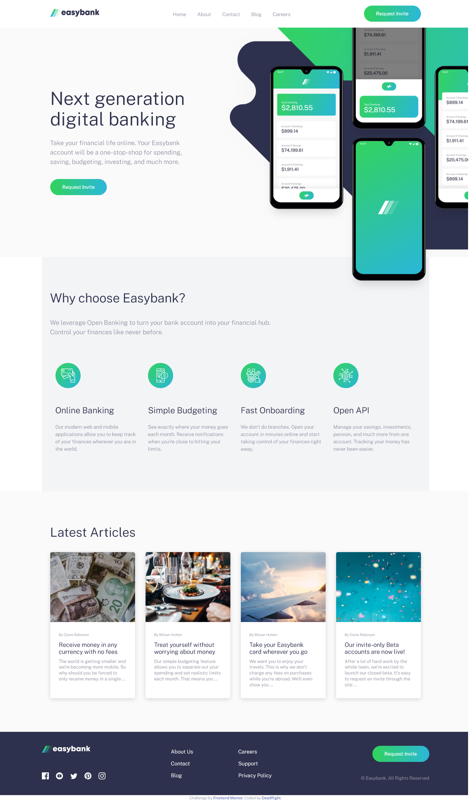
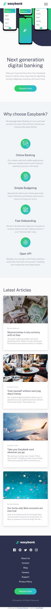

# Frontend Mentor - Easybank landing page solution

This is a solution to the [Easybank landing page challenge on Frontend Mentor](https://www.frontendmentor.io/challenges/easybank-landing-page-WaUhkoDN). Frontend Mentor challenges help you improve your coding skills by building realistic projects.

## Table of contents

- [Overview](#overview)
  - [The challenge](#the-challenge)
  - [Screenshot](#screenshot)
  - [Links](#links)
- [My process](#my-process)
  - [Built with](#built-with)
  - [What I learned](#what-i-learned)
- [Author](#author)
- [Acknowledgments](#acknowledgments)

## Overview

### The challenge

Users should be able to:

- View the optimal layout for the site depending on their device's screen size
- See hover states for all interactive elements on the page

### Screenshot

-Desktop Version

-Mobile Version

### Links

- Solution URL: [Repository](https://github.com/Deadflight/easybank-landing-page-master)
- Live Site URL: [Live site](https://deadflight.github.io/easybank-landing-page-master/)

## My process

### Built with

- Semantic HTML5 markup
- CSS custom properties
- Flexbox
- CSS Grid
- Mobile-first workflow
- [Vanilla JavaScript](https://developer.mozilla.org/es/docs/Web/JavaScript)
- [Sass](https://sass-lang.com/) - For styles

### What I learned

I learned how to carry out this project and about sass as well as its implementation and its workflow thanks to the youtuber [Coder Coder](https://www.youtube.com/channel/UCzNf0liwUzMN6_pixbQlMhQ)

## Author

- Website - [Deadflight](https://deadflight.github.io/portfolio/)
- Frontend Mentor - [@Deadflight](https://www.frontendmentor.io/profile/Deadflight)
- Twitter - [@Deadfligth](https://twitter.com/Deadfligth)
- Linkedin - [@Deadfligth](https://www.linkedin.com/in/deadflight/)
- Facebook - [@Deadflight](https://www.facebook.com/Carlos-Correa-105811761669254)
- Email - [correamillancarlos@gmail.com]

## Acknowledgments

I would like to thank youtuber [Coder Coder](https://www.youtube.com/channel/UCzNf0liwUzMN6_pixbQlMhQ) for instructing with her videos on how to carry out a project of this type with the use of Sass, a technology that I had the pleasure of knowing and learning from her in this project
